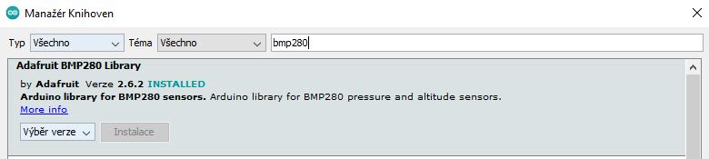

# Šindler-ročníkový projekt
Cílem mého projektu bylo využití produktů od M5Stack v každodenním životě. V tomto případě jsem pracoval s [M5Stack ATOM Matrix](https://rpishop.cz/m5stack/2766-m5stack-atom-matrix-esp32-development-kit.html) a [M5Stack Core 2](https://rpishop.cz/m5stack/3066-m5stack-core2-esp32-iot-vyvojova-sada.html) a využil oba tyto produkty ke sbírání dat ohledně teploty, tlaku atd..

Obě části projektu byly programovány v [Arduino IDE](https://www.arduino.cc/en/software).

## M5Stack ATOM Matrix
ATOM matrix jsem použil pro měření pokojové teploty a tlaku pomocí senzoru [BMP 280](https://www.laskakit.cz/arduino-senzor-barometrickeho-tlaku-a-teploty-bmp280/). Výsledky měření se poté zobrazovaly na webové stránce a také v aplikaci blynk pomocí grafů.

### Blynk setup

>Blynk stáhneme buď na Google Play nebo App Store

</img> 

>Po stažení a registraci klikneme na tlačítko pro vytvoření nového projektu

</img>

>Projekt si pojmenujeme

</img> 

>Vybereme zařízení, v tomto případě to bude **ESP32 Dev Board**

</img>

>Jako typ připojení zvolíme WiFi a vytvoříme projekt

</img>

>V novém projektu klikneme na tlačíkto pro přidání widgetů

>Po přetažení složky ICONS na SD kartu, můžeme otevřít soubor 
</img>

>Pro zobrazení hodnot pomocí grafu zvolíme SuperChat

</img>

>Po zvolení widgetu klikneme na tlačítko pro úpravy 

</img>

>Do grafu přídáme proměnné, které chceme, aby se zobrazovaly

</img>

>Proměnné si pojmenujeme a klikneme na tlačítko pro jejich úpravu

</img>

>Klikneme na tlačítko pro přidělení pinu

</img>

>Vybereme virtuální pin 4, u druhé proměnné vybereme pin 5, tímto krokem je Blynk setup hotov

</img>

### Arduino setup

>V Arduino IDE klikneme na Soubor>Vlastnosti a  do políčka **Správce dalších desek URL** zkopírujeme tento odkaz: https://raw.githubusercontent.com/espressif/arduino-esp32/gh-pages/package_esp32_index.json a klikneme na OK

</img>

>Poté, znovu v Arduino IDE klikneme na Nástroje>Vývojová deska>Manažér desek a vyhledáme a nainstalujeme desku **esp32**

</img>

>Po nainstalování desky v Arduino IDE klikneme na Nástroje>Vývojová deska>ESP32 Arduino a zvolíme M5Stack-Atom

</img>

>Pro instalaci potřebných knihoven klikneme na Nástroje>Spravovat knihovny a postupně nainstalujeme tyto knihovny:

</img>
</img>
</img>

>Po této instalaci máme Arduino setup hotový

### Zapojení BMP 280 k Atom Matrix

>Drátky mohou být zapojeny přímo do pinů Atom Matrix nebo na nepájivém poli

</img>

</img>

>Teď už stačí Atom matrix pouze připojit k PC pomocí USB-C kabelu a v Arduino IDE v Nástroje>Port vybrat příslušné číslo portu. 

>Poté ze složky **Atom_Server** zkopírujeme kód, přepíšeme potřebné proměnné a nahrajeme ho na Atom Matrix.

</img>

>Po nahrání kódu se v aplikaci Blynk začnou vykreslovat grafy

</img>

>Pro zobrazení webové stránky musíme do vyhledávání prohlížeče vložit IP adresu, kterou Atom Matrix získá po připojení k WiFi a vypíše ji na sériový monitor(v Arduino IDE v pravém horním rohu).

</img>

## M5Stack Core 2
Core 2 jsem použil pro zobrazení venkovní teploty v lokalitě, která se dá změnit v kódu. Pro získání teploty jsem použil API klíč ze stránky https://openweathermap.org/.

Pro usnadnění práce jsem v kódu nechal svůj API klíč, ale pokud chcete vlastní, stačí se zaregristrovat na výše uvedené stránce.

### Arduino setup

>Nejprve budeme muset stáhnout celý projekt na náš počítač v zip formátu

</img>

>Poté bude zapotřebí stažený soubor rozbalit

</img>

>V rozbalené složce poté klikenem na složku M5_Core2_json a v ní by se měly nacházet kód s fonty textu a ikonky

</img>

>Pro zobrazení ikonek na displeji musíme složku ICONS přetáhnout na micro SD kartu, kterou poté vložíme do Core 2, bez SD karty program bude fungovat, ale bez ikonek

>Po přetažení složky ICONS na SD kartu můžeme otevřít soubor **M5_Core2_json.ino**. Setup v Arduino IDE je skoro hotový díky předešlé části projektu, bude za potřebí pouze stáhnout potřebné knihovny

>V Arduino IDE klikneme na Nástroje>Spravovat knihovny a dostahujeme tyto postupně tyto knihovny

</img>
</img>

>Po nainstalování knihoven ještě musíme v Nástroje>Vývojová deska: změnit desku na Core 2

</img>

>Teď už jen stačí v Nástroje>Port vybrat příslušné číslo portu a v kódu změnit potřebné proměnné a nahrát ho na Core2
